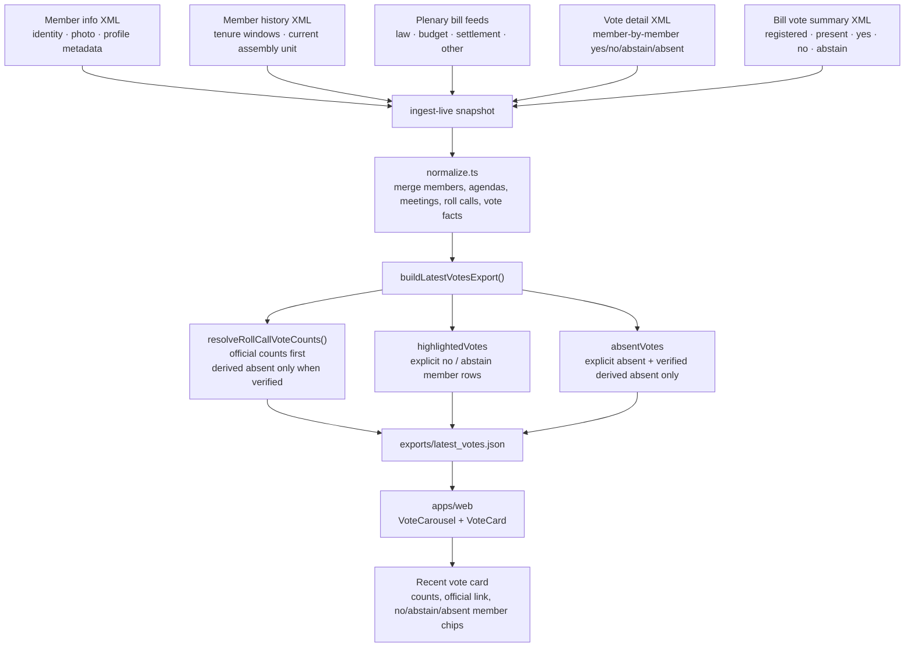
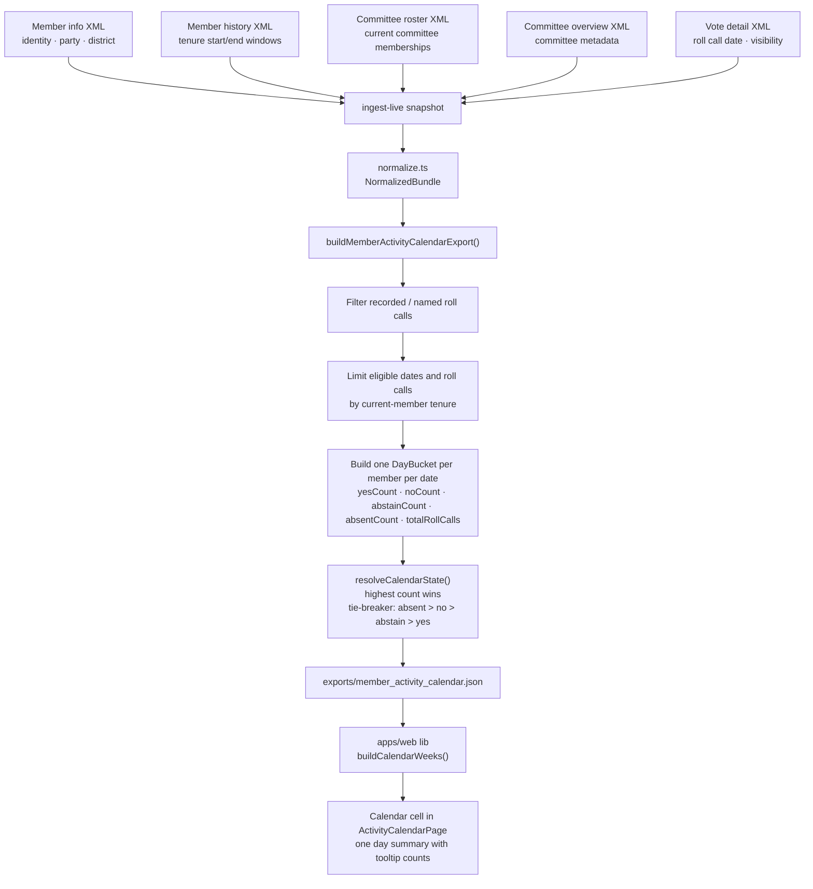

# Lawmaker Monitor

Lawmaker Monitor는 정적 웹 배포, 스케줄 기반 배치 수집, 브라우저 내부 분석을 분리해 구성한 준실시간 국회 표결 추적 서비스입니다.

## 저장소 구성

- `apps/web`: GitHub Pages에 배포되는 React + Vite 프런트엔드
- `packages/ingest`: TypeScript 기반 수집기, 파서, 정규화 로직, export 생성기
- `packages/schemas`: manifest와 정규화 레코드에 대한 공용 Zod 스키마 및 TypeScript 타입
- `tests/fixtures`: 파서와 계약 테스트를 위한 고정 상류 데이터 fixture
- `.github/workflows`: 수집, 데이터 빌드, 소스 모니터링, 웹 배포를 담당하는 GitHub Actions 워크플로

## 운영 모델

- 이 저장소는 코드, 테스트, 오케스트레이션을 담당합니다.
- 별도의 공개 데이터 저장소는 raw snapshot, 정제된 Parquet 파일, 경량 JSON export, manifest를 저장합니다.
- 사용자 신뢰의 기준점은 공식적으로 확정된 표결 기록이며, live signal 수집은 polling 전략과 provisional 표시 수준에만 영향을 줍니다.

## 명령어

```bash
npm install
npm test
npm run typecheck
npm run build
```

### 워크스페이스 스크립트

```bash
npm run dev:web
npm run ingest:live
npm run build:data
npm run mirror:documents
npm run monitor:sources
```

## 환경 변수

수집 워크플로는 CI에서 아래 값만 지원합니다.

- `ASSEMBLY_API_KEY`
- `ASSEMBLY_PAGE_SIZE`
- `ASSEMBLY_BILL_FEED_CONCURRENCY`
- `ASSEMBLY_VOTE_DETAIL_CONCURRENCY`
- `ASSEMBLY_BILL_VOTE_SUMMARY_CONCURRENCY`
- `ASSEMBLY_FETCH_TIMEOUT_MS`
- `ASSEMBLY_FETCH_RETRIES`
- `DATA_REPO`
- `DATA_REPO_BRANCH`
- `DATA_REPO_BASE_URL`
- `DATA_REPO_PAT`
- `MIRROR_MODE`
- `MIRROR_START_URL`
- `MIRROR_RECENT_DAYS`
- `MIRROR_BACKFILL_START_DATE`
- `MIRROR_BACKFILL_DAYS`
- `MIRROR_INCLUDE_APPENDICES`

국회 OpenAPI 수집은 `ASSEMBLY_API_KEY`를 전제로 구성되어 있습니다. 키가 없으면 일부 endpoint가 sample 제한 응답으로 돌아와 pagination과 bulk 수집이 왜곡될 수 있습니다.
수집 endpoint와 서비스 코드는 코드 내부 registry가 고정합니다. 운영 환경에서 base URL, path, assembly fallback을 env로 덮어쓰는 방식은 더 이상 지원하지 않습니다.

## 데이터 배포 계약

- `raw/<snapshot_id>/...`: 변경하지 않는 원본 payload와 수집 메타데이터
- `curated/*.parquet`: 정규화된 데이터셋
- `exports/latest_votes.json`: 첫 화면용 경량 피드 payload
- `manifests/latest.json`: 데이터셋 탐색용 메타데이터

## Visualization Data Flow

The public web application is driven by a small set of derived exports. The two diagrams below show how the most visible UI elements are assembled from upstream Assembly sources.

### Recent Vote Card



### Activity Calendar Cell



## 공개 문서 미러링

- `mirror-documents`는 `record.assembly.go.kr` 국회 회의록 시스템을 위한 전용 `assembly_minutes_search` 모드를 지원합니다.
- assembly 모드에서는 공식 회의록 검색 페이지를 한 번 열고, 그 브라우저 상태를 재사용해 실제 UI가 호출하는 JSON 검색 endpoint를 그대로 요청합니다.
- 매일 실행할 때 최근 재동기화 구간과 소규모 과거 백필 구간을 함께 처리하며, 두 구간 모두 `Asia/Seoul` 기준 오늘보다 과거 문서만 대상으로 삼습니다.
- 미러링된 파일은 `raw/documents/<source>/<YYYY>/<MM>/<DD>/<document-id>/` 아래에 저장됩니다.
- 각 문서 디렉터리에는 `latest.<ext>`, 버전별 스냅샷, `metadata.json`이 들어갑니다.
- `raw/index/document_index.json`과 `manifests/document_mirror_state.json`은 매 실행마다 갱신됩니다.
- 기본 bootstrap 설정은 `2024-05-30`부터 시작하는 제22대 국회 검색 범위를 대상으로 하며, 필요하면 회의록 부록도 함께 포함할 수 있습니다.

## Reference Material for AI-Assisted Work

- `docs/references/assembly-openapi-reference.md`: a compact human-and-AI-oriented reference derived from the official Assembly OpenAPI guide
- `docs/references/assembly-openapi-endpoints.json`: a machine-readable endpoint registry for prompts, scripts, and agent tooling

## Open Source Acknowledgements

Lawmaker Monitor is built on top of several open source tools and libraries.

- [React](https://react.dev/) (MIT): component model and client-side rendering for the public web application
- [Vite](https://vite.dev/) (MIT): local development server and production build pipeline for the frontend
- [Recharts](https://recharts.org/) (MIT): charts used in the home dashboard and activity comparison views
- [Zod](https://zod.dev/) (MIT): runtime schema validation and shared data contracts across packages
- [Vitest](https://vitest.dev/) (MIT): workspace test runner for ingest, contracts, and frontend behavior
- [TypeScript](https://www.typescriptlang.org/) (Apache-2.0): static typing across the ingest pipeline, schemas, and web app

Please review each upstream project for full license terms and attribution requirements.

## Data Source and Reuse Notice

Lawmaker Monitor uses public data and records provided by the National Assembly of the Republic of Korea.


- Primary source: [The National Assembly of the Republic of Korea](https://www.assembly.go.kr/)
- Materials marked with KOGL (Korea Open Government License) Type 1 may be reused with attribution.
- Materials without an explicit open reuse mark may require separate permission from the original rights holder.
- Before redistributing screenshots, reproduced documents, or derived materials, verify the reuse policy shown on the original source page.
- When online attribution is possible, provide a hyperlink to the original source page.
- Do not imply endorsement, sponsorship, or any special relationship with the originating public institution.
- Respect moral rights when adapting public works, and avoid edits that distort the original meaning or damage the original author's reputation.
- Public institutions do not guarantee continued availability or accuracy of the materials, and reuse permission may terminate automatically if the license conditions are violated.
